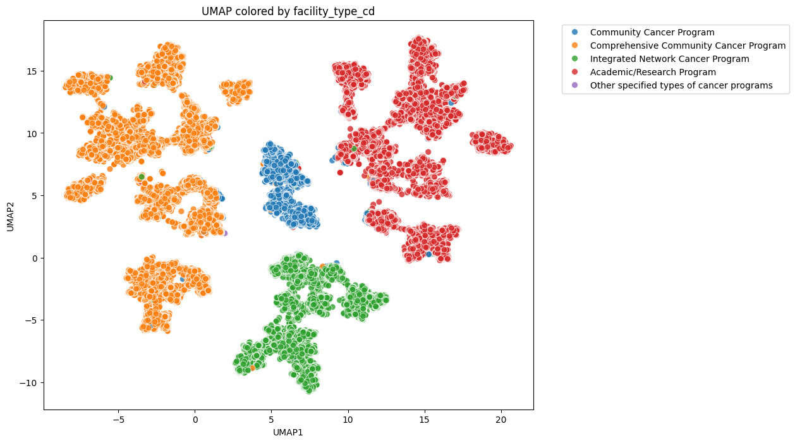
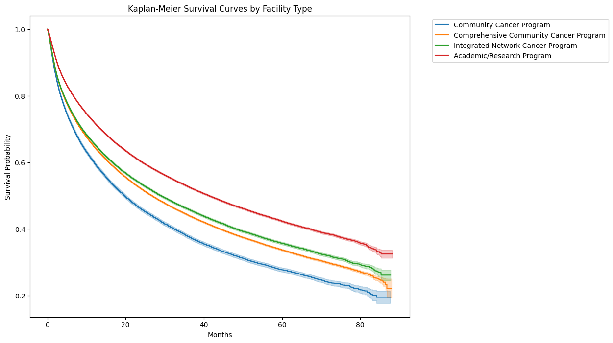

# Exploratory Data Analysis

### Research Question and Dataset Overview

The central research question(s) of this project is: **Can clinically coherent phenotypes of lung cancer patients be identified using block‑wise, clinically constrained dimension reduction and clustering, and do these phenotypes demonstrate distinct survival outcomes beyond traditional stage‑based classification?** In other words, can integrating demographic, comorbidity, tumor biology, disease burden, and treatment strategy data reveal patient subgroups with meaningful prognostic and phenotypic differences that are not captured by typical cancer staging alone.

The data is a lung cancer dataset derived from the National Cancer Database (NCDB). The NCDB is a large, hospital‑based oncology registry jointly sponsored by the American College of Surgeons (ACS) Commission on Cancer (CoC) and the American Cancer Society. The dataset represents adults diagnosed with invasive lung cancer and includes:

- Over half a million de‑identified patient records
- Diagnoses across multiple U.S. regions and facility types from the years 2018-2022
- Variables spanning demographics, socioeconomic context, comorbidity, tumor characteristics, stage, metastatic patterns, treatment modalities, and survival follow‑up

This dataset is consider to be legally and ethically appropriate for research use for the following reasons:

- **De‑identification:** The NCDB contains no direct patient identifiers (e.g. names, exact dates of birth, addresses). All records are de‑identified in compliance with HIPAA Safe Harbor standards.
- **Data Use Agreement (DUA):** Access to the NCDB requires approval through a formal application process and is governed by an ACS Data Use Agreement, which restricts attempts at re‑identification and limits use to approved research purposes.
- **No Protected Health Information (PHI):** Because the dataset is de‑identified and provided for secondary research, it does not constitute human subjects research requiring IRB oversight in most institutions (though local IRB policies may still apply).

There are no direct ethical concerns related to privacy, consent, or data misuse, provided the ACS DUA is followed and results are reported in aggregate without attempting patient‑level inference.

Reference: American College of Surgeons. National Cancer Database (NCDB).
https://www.facs.org/quality-programs/cancer-programs/national-cancer-database/

***

### Data Description and Variables

| Variable Name              | Description                                               |
| -------------------------- | --------------------------------------------------------- |
| `puf_case_id`              | Unique, anonymized identifier for each cancer case in the NCDB PUF |
| `puf_facility_id`          | Anonymized identifier for the reporting CoC‑accredited facility |
| `year_of_diagnosis`        | Calendar year of initial lung cancer diagnosis            |
| `facility_type_cd`         | CoC facility classification (e.g., Academic, Community)   |
| `facility_location_cd`     | U.S. Census division of treating facility                 |
| `age`                      | Age at diagnosis (years)                                  |
| `sex`                      | Sex recorded in the medical record                        |
| `race`                     | Primary race category                                     |
| `spanish_hispanic_origin`  | Hispanic/Latino ethnicity indicator                       |
| `insurance_status`         | Primary payer at diagnosis                                |
| `no_hsd_quar_2020`         | ZIP‑code–level education quartile (no HS diploma)         |
| `med_inc_quar_2020`        | ZIP‑code–level median income quartile                     |
| `ur_cd_23`                 | Urban–rural classification (2023 USDA)                    |
| `crowfly`                  | Straight‑line distance from residence to facility (miles) |
| `cdcc_total_best`          | Charlson–Deyo comorbidity score (0–≥3)                    |
| `tobacco_use`              | Smoking history at diagnosis                              |
| `primary_site`             | ICD‑O‑3 topography (lung subsite)                         |
| `laterality`               | Side of lung affected                                     |
| `histology`                | ICD‑O‑3 histologic subtype                                |
| `lymph_vascular_invasion`  | Presence/absence/unknown of LVI on pathology              |
| `analytic_stage_group`     | Consolidated AJCC stage (0–IV)                            |
| `regional_nodes_positive`  | Number/status of positive regional lymph nodes            |
| `mets_at_dx_*` variables   | Presence of metastatic disease at specific sites          |
| `tumor_size_summary_2016`  | Largest primary tumor dimension (mm or Unknown)           |
| `rx_summ_surg_prim_site`   | Whether and what type of surgery was performed            |
| `rx_summ_treatment_status` | Any first‑course treatment given                          |
| `rx_summ_chemo`            | Chemotherapy as part of first course                      |
| `rx_summ_immunotherapy`    | Immunotherapy as part of first course                     |
| `rx_summ_surgrad_seq`      | Sequence of surgery and radiation                         |

#### **Target Variables**

| Target Variable               | Definition                                            |
| ----------------------------- | ----------------------------------------------------- |
| `dx_lastcontact_death_months` | Time from diagnosis to last contact or death (months) |
| `puf_vital_status`            | Vital status at last contact (Alive/Dead)             |

The dataset was first filtered to retain only cases with non‑missing survival time, vital status, and diagnosis year, and was restricted to diagnoses from 2018–2022 to ensure complete survival follow‑up. Records were further filtered to include only invasive lung cancers with positive histologic or cytologic confirmation, rows diagnosed before the facility reference date were removed, and rows missing key socioeconomic or geographic variables were excluded. Columns containing only missing values or a single unique value were dropped, and the dataset was reduced to a prespecified set of clinically relevant variables. Categorical variables were harmonized by collapsing detailed categories, explicitly labeling “Unknown” where appropriate, and tumor size “Unknown” values were converted to missing with a corresponding indicator variable created.

***

### Summary Statistics of Relevant Variables

| Variable Name              | Mean    | Std. Dev.  | Median   | Q1    | Q3    | Range    |
| -------------------------- | ------- | ---------- | -------- | ----- | ----- | -------- |
| Age (years old)            | 69.57   | 9.64       | 70       | 63    | 77    | 50       |
| Tumor Size (mm)            | 37.71   | 35.19      | 30       | 18    | 50    | 989      |
| Survival Time of Deceased Patients (in months) | 14.14 | 15.06 | 8.51 | 2.73 | 20.67 | 86.8 |

| Sex              | Count  | Percentage |
| -----------------| ------ | ---------- |                  
| Female           | 253951 |    50.65   |
| Male             | 247418 |    49.35   | 

| Stage Group              | Count  | Percentage |
| -------------------------| ------ | ---------- |
| Occult (lung only)       | 217    |    0.04    |
| Stage 0                  | 444    |    0.09    |
| Stage I                  | 161450 |   32.20    |
| Stage II                 | 45889  |    9.15    |
| Stage III                | 90386  |   18.03    |     
| Stage IV                 | 173554 |   34.62    |
| AJCC Staging not applicable | 18030 |  3.60    |
| AJCC Stage Group unknown | 11399  |    2.27    |

| Comorbidity Index        | Count  | Percentage |
| -------------------------| ------ | ---------- |
| 0                        | 286978 |    57.24   |
| 1                        | 116131 |    23.16   |
| 2                        | 51938  |    10.36   |
| >=3                      | 46322  |     9.24   |

#### **Correlation Matrix**
| Variable                         | Age    | Distance to Hospital | Tumor Size | Survival Time of Deceased Patients |
|----------------------------------|--------|----------|--------------------------|------------------------------|
| Age                              | 1.000  | -0.016   | -0.020                   | -0.031                       |
| Distance to Hospital                         | -0.016 | 1.000    | -0.007                   | 0.012                        |
| Tumor Size          | -0.020 | -0.007   | 1.000                    | -0.164                       |
| Survival Time of Deceased Patients      | -0.031 | 0.012    | -0.164                   | 1.000                        |

Tumor size shows the strongest numeric relationship with survival among deceased patients ($r=−0.164$), with larger tumors associated with shorter survival, while age and distance to hospital have negligible correlations with survival. The cohort is predominantly older (median age = 70 years) and demonstrates substantial variability in tumor size, including extreme upper values, indicating heterogeneous disease burden. More than half of patients exhibit advanced disease (Stages III–IV $\approx 53%$), which aligns with the short median survival observed among deceased patients (8.5 months). Overall, tumor burden appears to be more informative for survival differences than age, comorbidity, or geographic access, highlighting disease severity as the dominant driver of outcomes.

***

### Visual Exploration

#### **Plot 1**

This UMAP plot is a two‑dimensional visualization of the dataset after block-wise dimensionality reduction. Each point represents a patient and spatial proximity reflects similarity across the reduced clinical feature space. Coloring by `facility_type_cd` shows that patients treated at different facility types (community, comprehensive community, integrated network, academic/research) tend to occupy overlapping but partially distinct regions, indicating non‑random structure related to care setting. The visualization suggests that health‑system context aligns with broader patient phenotypes. The partial clustering by facility type shows that care context is associated with distinct combinations of patient, tumor, and treatment characteristics.

#### **Plot 2**

This Kaplan–Meier plot displays overall survival over time for lung cancer patients, stratified by facility type (community, comprehensive community, integrated network, and academic/research programs). Each curve represents the estimated probability of survival as a function of months since diagnosis, allowing direct visual comparison of survival trajectories across care settings. The curves suggest systematic differences in survival, with patients treated at academic/research programs showing higher survival probabilities over time than those treated at other facility types. The plot helps us visualize whether health‑system context is associated with differences in patient outcomes, independent of individual tumor and patient characteristics.

### Challenges and Reflection

Clustering a very large dataset is challenging due to computational and memory constraints, which limit the use of distance‑based methods—even after dimensionality reduction. Handling mixed data types and informative missingness adds further complexity, since improper encoding can bias downstream analysis toward data‑collection artifacts rather than clinical patterns. In addition, performing analyses at this scale makes it harder to iteratively tune preprocessing choices (such as scaling, transformation, and feature selection) because each full run can be time‑consuming. There is also a risk that subtle data‑quality issues or imbalances become amplified in results.

