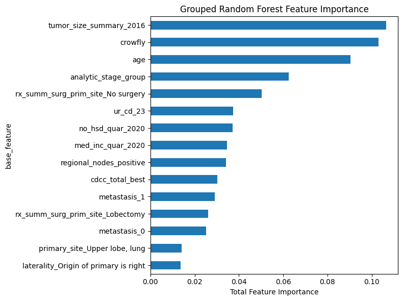

# Supervised Learning Analysis: Lung Cancer Survival

## 1. Problem Context and Research Question

The goal of this project is to evaluate whether patient-level clinical, demographic, and treatment variables can be used to predict mortality outcomes among lung cancer patients. Specifically, this analysis investigates how traditional survival modeling and machine-learning classification differ in their ability to capture prognostic signal and characterize risk patterns in a large, heterogeneous oncology cohort.

## 2. Supervised Models Implemented

Two supervised models were implemented to predict patient outcomes: a Cox Proportional Hazards model for time-to-event analysis and a Random Forest classifier for binary survival prediction. The Cox model provides a classical, interpretable baseline rooted in survival analysis, while the Random Forest serves as a more flexible, nonlinear model capable of capturing complex interactions among covariates.

| Model Type | Key Hyperparameters Explored | Validation Strategy | Performance Metrics |
|------------|------------------------------|---------------------|---------------------|
| Cox Proportional Hazards | Baseline hazard via Breslow estimator; cluster indicators as covariates | Full cohort fit | Concordance = 0.71 |
| Random Forest Classifier | n_estimators ∈ {300, 500}, max_depth ∈ {None, 10}, class_weight = balanced | 80/20 stratified train–test split; 3-fold CV via GridSearchCV | Accuracy = 0.73, ROC-AUC = 0.80, PR-AUC = 0.80 |

For the Random Forest model, preprocessing steps including scaling, ordinal encoding, and one-hot encoding were applied within a scikit-learn Pipeline to prevent data leakage. Hyperparameters were tuned using GridSearchCV on the training set. Several performance metrics were calculated to give a more holistic view of model performance.

## 3. Model Comparison and Selection

Across both supervised approaches, clear and consistent prognostic structure emerged. The Cox Proportional Hazards model demonstrated strong global discrimination, with a concordance score of 0.71 and highly significant hazard ratios across cluster-defined phenotypes. However, proportional hazards assumption checks indicated systematic violations for cluster indicators, suggesting time-varying effects and limiting the interpretability of constant hazard ratios. The Random Forest model exhibited moderate predictive performance for binary mortality outcomes, achieving a test ROC-AUC of 0.80 and a PR-AUC of 0.80. The Random Forest exhibited perfect training accuracy with a test accuracy of 0.73. This overfitting was a challenge

## 4. Explainability and Interpretability

To interpret the Random Forest model, grouped feature importance analysis was performed by aggregating importance values across one-hot encoded features to their original variable names. This analysis revealed that disease stage, tumor size, metastasis status, and treatment-related variables were among the strongest contributors to mortality prediction. Notably, the Cox Proportional Hazards model demonstrated that cluster membership also ranked highly in overall importance, providing independent validation that the previously identified unsupervised phenotypes encode meaningful prognostic information.

## 5. Final Takeaways

This supervised learning analysis demonstrates that lung cancer survival outcomes can be predicted with substantial accuracy using routinely collected clinical and treatment data. The Cox Proportional Hazards model confirmed strong survival heterogeneity across patient phenotypes, while the Random Forest classifier achieved moderate predictive performance for binary mortality outcomes by capturing nonlinear effects and interactions. Feature importance analysis further showed that model predictions align with established clinical risk factors, including stage, tumor burden, treatment modality, and phenotype membership.

Overall, these results directly address the research question by showing that supervised models, particularly flexible machine-learning approaches, can effectively translate complex patient data into accurate and interpretable survival predictions that complement traditional survival analysis.