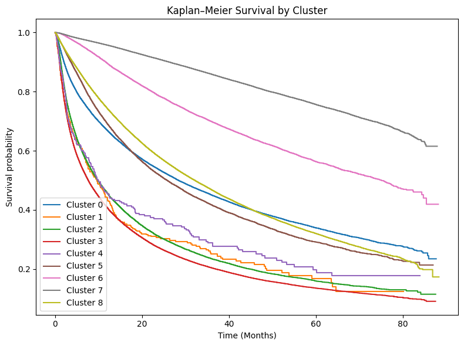
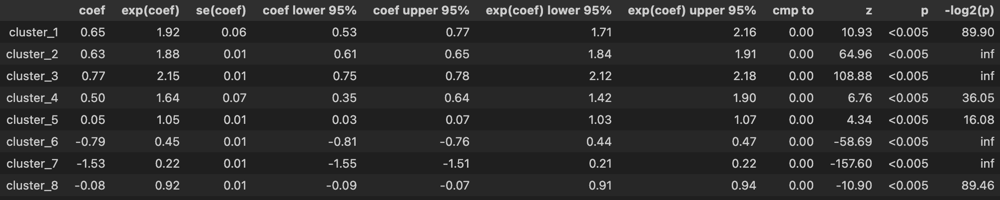

# Final Report

This project examined lung cancer outcomes using a combination of unsupervised learning, survival analysis, and supervised machine learning to better understand patient heterogeneity and mortality risk. The primary objective was not only to predict survival outcomes, but also to uncover clinically meaningful patient archetypes and assess whether these latent groupings added insight beyond traditional supervised models.

In addition to supervised modeling, dimensionality reduction and clustering were used as a core methodological extension. High‑dimensional clinical, demographic, and treatment data were first embedded using UMAP (n_components=10, n_neighbors=30, min_dist=0.1) to preserve local patient similarity (trustworthiness sub-sample score of 0.9712), followed by density‑based clustering with HDBSCAN (min_cluster_size=100, min_samples=200, metric="euclidean", cluster_selection_method="eom"). This approach identified nine stable patient archetypes with minimal noise (noise fraction = 0.008) and strong reproducibility (ARI mean = 0.806 and std = 0.236). These archetypes corresponded to distinct clinical profiles, ranging from early‑stage, surgically treated patients with excellent long‑term survival to advanced metastatic phenotypes characterized by high early mortality and intensive systemic therapy. Intermediate archetypes reflected locally advanced disease, node‑positive tumors, and mixed treatment pathways, highlighting substantial heterogeneity within the population.

The integration of clustering with supervised learning yielded insights that were not apparent from supervised models alone. Cluster membership emerged as a highly informative predictor of outcomes. Survival analysis revealed marked differences in Kaplan–Meier curves and hazard profiles across archetypes, and feature importance analysis in the Random Forest classifier confirmed that phenotype membership contributed independently alongside stage, tumor size, metastasis status, and treatment variables. This suggests that the unsupervised archetypes captured higher‑order interactions and care patterns not fully summarized by individual covariates.

In conclusion, this analysis shows that combining unsupervised clustering with supervised modeling provides a richer and more clinically interpretable understanding of lung cancer outcomes. Patient archetypes derived from UMAP and HDBSCAN revealed distinct disease trajectories and treatment patterns that complemented traditional survival models. Together, these methods demonstrate that integrating representation learning, clustering, and supervised prediction can enhance both prognostic accuracy and clinical insight in large observational health datasets.
